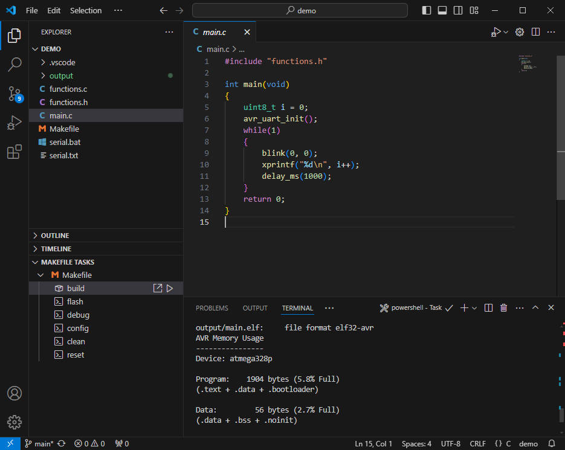

# atmega328p

	A very lighted development tool for atmega328p, flasher is dwdebug(https://github.com/dcwbrown/dwire-debug)
	
## How to install
	1. Install AVR-Toolchain.exe, after installed, a Environment variable will be added to the Path, such as x:\software\AVR-Toolchain\bin
	2. Install two extensions in vscode: Make support and task provider, published by carlos-algms, Serial Monitor, published by Microsoft.

## How to use
	Open the demo folder by vscode.
	Build: click the "build" button in the left lower corner of MAKEFILE TASKS, the files in the demo folder will be compiled.
	Flash: after build, click the "flash" button in the left lower corner of MAKEFILE TASKS, the .elf in demo/output folder will be flashed to atmega328p.
	
	